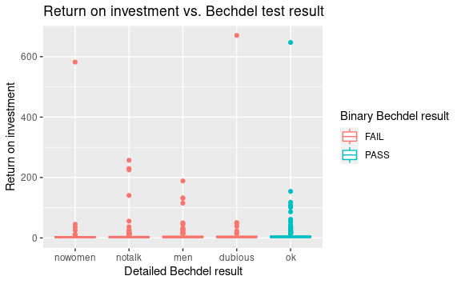

Bechdel Test
================
Logan

Below is a section that starts with three backticks (i.e, the key above
your Tab key) - not to be confused with a single quotation mark. This is
called an R code chunk. In this code chunk, I am setting some global
options for this `.Rmd` report: forcing your report to knit even if
there are errors and the figure dimensions. For the time being you can,
“pay not attention to the code between lines 12 and 14.”

In this mini analysis we work with the data used in the FiveThirtyEight
story titled [“The Dollar-And-Cents Case Against Hollywood’s Exclusion
of
Women”](https://fivethirtyeight.com/features/the-dollar-and-cents-case-against-hollywoods-exclusion-of-women/).
This activity is adapted from [Dr. Mine
Çetinkaya-Rundel](http://www2.stat.duke.edu/~mc301/)’s [STA
199](http://www2.stat.duke.edu/courses/Spring18/Sta199/) course.

I do **not** expect the R code to make sense yet, but you should be able
to interpret the output and use your Markdown skills to provide a
response to the questions that I ask.

## Data and packages

In RMarkdown files, we can interweave narrative and R code chunks. For
example, in the code chunk below we are loading two packages:
`{fivethirtyeight}` and `{tidyverse}`. There are a number of ways to run
this code, but for the time being **knit** your document (in the tool
bar of this Rmd file, click on 
**Knit**).

``` r
library(fivethirtyeight)
library(tidyverse)
```

You might see an warning message at the top of your `.Rmd` file that
says, “Package fivethirtyeight required but is not installed.” In your
**Console** (lower-left-hand area) type
`install.packages("fivethirtyeight")`. You only need to install a
package once and this should always be done in your **Console**. That
is, do not install packages within RMarkdown files!

Another nice feature of RMarkdown files is that we can write R code
within a narrative block. The next paragraph has three inline R code
calls that will display the results of the code when you knit this
document.

The dataset contains information on 1794 movies released between 1970
and 2013. However we will focus our analysis on movies released between
1990 and 2013.

``` r
bechdel90_13 <- bechdel %>% 
  filter(between(year, 1990, 2013))

bechdel90_13
```

    ## # A tibble: 1,615 x 15
    ##     year imdb   title    test   clean_test binary budget domgross intgross code 
    ##    <int> <chr>  <chr>    <chr>  <ord>      <chr>   <int>    <dbl>    <dbl> <chr>
    ##  1  2013 tt171… 21 & Ov… notalk notalk     FAIL   1.3 e7 25682380   4.22e7 2013…
    ##  2  2012 tt134… Dredd 3D ok-di… ok         PASS   4.5 e7 13414714   4.09e7 2012…
    ##  3  2013 tt202… 12 Year… notal… notalk     FAIL   2   e7 53107035   1.59e8 2013…
    ##  4  2013 tt127… 2 Guns   notalk notalk     FAIL   6.1 e7 75612460   1.32e8 2013…
    ##  5  2013 tt045… 42       men    men        FAIL   4   e7 95020213   9.50e7 2013…
    ##  6  2013 tt133… 47 Ronin men    men        FAIL   2.25e8 38362475   1.46e8 2013…
    ##  7  2013 tt160… A Good … notalk notalk     FAIL   9.2 e7 67349198   3.04e8 2013…
    ##  8  2013 tt219… About T… ok-di… ok         PASS   1.2 e7 15323921   8.73e7 2013…
    ##  9  2013 tt181… Admissi… ok     ok         PASS   1.3 e7 18007317   1.80e7 2013…
    ## 10  2013 tt181… After E… notalk notalk     FAIL   1.3 e8 60522097   2.44e8 2013…
    ## # … with 1,605 more rows, and 5 more variables: budget_2013 <int>,
    ## #   domgross_2013 <dbl>, intgross_2013 <dbl>, period_code <int>,
    ## #   decade_code <int>

How many movies are there?

**Response**: 1794

The financial variables that we will focus on are:

-   `budget_2013`: Budget in 2013 inflation adjusted dollars
-   `domgross_2013`: Domestic gross (US) in 2013 inflation adjusted
    dollars
-   `intgross_2013`: Total International (i.e., worldwide) gross in 2013
    inflation adjusted dollars

Also, we will use the `binary` and `test_clean` variables for grouping.

## Analysis

First, we will take a look at how median budget and median gross (both
domestic and international) vary by whether the movie passed the Bechdel
test.

``` r
bechdel90_13 %>%
  group_by(binary) %>%
  summarise(med_budget = median(budget_2013),
            med_domgross = median(domgross_2013, na.rm = TRUE),
            med_intgross = median(intgross_2013, na.rm = TRUE))
```

    ## # A tibble: 2 x 4
    ##   binary med_budget med_domgross med_intgross
    ##   <chr>       <dbl>        <dbl>        <dbl>
    ## 1 FAIL    48385984.    57318606.    104475669
    ## 2 PASS    31070724     45330446.     80124349

What patterns do you notice?

**Response**: It looks like movies that fail the test have higher
budgets and tend to have a higher gross revenue.

Next, we will take a look at how median budget and median gross vary by
a more granular (detailed) indicator of the Bechdel test result (where
`ok` = passes test, `dubious`, `men` = women only talk about men,
`notalk` = women don’t talk to each other, `nowomen` = fewer than two
women).

``` r
bechdel90_13 %>%
  group_by(clean_test) %>%
  summarise(med_budget = median(budget_2013),
            med_domgross = median(domgross_2013, na.rm = TRUE),
            med_intgross = median(intgross_2013, na.rm = TRUE))
```

    ## # A tibble: 5 x 4
    ##   clean_test med_budget med_domgross med_intgross
    ##   <ord>           <dbl>        <dbl>        <dbl>
    ## 1 nowomen     43373066     44891296.    89509349 
    ## 2 notalk      56570084.    63890455    123102194 
    ## 3 men         39737690.    56392786     99578022.
    ## 4 dubious     35790994     49173429     89883201 
    ## 5 ok          31070724     45330446.    80124349

What patterns do you notice?

**Response**: It looks like the ok rating gets the least budget and
least gross revenue.

In order to evaluate how return on investment varies among movies that
pass and fail the Bechdel test, we first create a new variable called
`roi` as the ratio of the gross to budget. However, I missed part of the
calculation. Update the missing variable (i.e., replace the `___` after
the minus sign with the appropriate variable name) in the code chunk
below so that we obtain the correct `roi`.

``` r
bechdel90_13 <- bechdel90_13 %>%
  mutate(roi = (intgross_2013 + domgross_2013 - budget_2013) / budget_2013)
```

Now we can see which movies have the highest return on investment.

``` r
bechdel90_13 %>%
  arrange(desc(roi)) %>% 
  select(title, clean_test, binary, roi, budget_2013, intgross_2013)
```

    ## # A tibble: 1,615 x 6
    ##    title                   clean_test binary   roi budget_2013 intgross_2013
    ##    <chr>                   <ord>      <chr>  <dbl>       <int>         <dbl>
    ##  1 Paranormal Activity     dubious    FAIL    670.      505595     218173082
    ##  2 The Blair Witch Project ok         PASS    647.      839077     347238122
    ##  3 El Mariachi             nowomen    FAIL    582.       11622       3390310
    ##  4 Clerks.                 notalk     FAIL    257.       42435       6120440
    ##  5 In the Company of Men   notalk     FAIL    230.       36281       4184879
    ##  6 Napoleon Dynamite       notalk     FAIL    226.      493277      56878201
    ##  7 Once                    men        FAIL    189.      173369      21956864
    ##  8 The Devil Inside        ok         PASS    154.     1014639     103248087
    ##  9 Primer                  notalk     FAIL    141.        8632        697797
    ## 10 Fireproof               men        FAIL    133.      541128      36226687
    ## # … with 1,605 more rows

Below is a visualization of the return on investment by test result,
however it’s difficult to see the distributions due to a few extreme
observations.

``` r
ggplot(data = bechdel90_13, mapping = aes(x = clean_test, y = roi, color = binary)) +
  geom_boxplot() +
  labs(title = "Return on investment vs. Bechdel test result",
       x = "Detailed Bechdel result",
       y = "Return on investment",
       color = "Binary Bechdel result")
```

    ## Warning: Removed 15 rows containing non-finite values (stat_boxplot).

<!-- -->

Zooming in on the movies with `roi < 10` provides a better view of how
the medians across the categories compare:

``` r
ggplot(data = bechdel90_13, mapping = aes(x = clean_test, y = roi, color = binary)) +
  geom_boxplot() +
  ylim(0, 10) +
  labs(title = "Return on investment vs. Bechdel test result",
       subtitle = "For ROI less than 10",
       x = "Detailed Bechdel result",
       y = "Return on investment",
       color = "Binary Bechdel result")
```

    ## Warning: Removed 365 rows containing non-finite values (stat_boxplot).

<!-- -->

What patterns do you notice?

**Response**:

Go back to the `README` document
